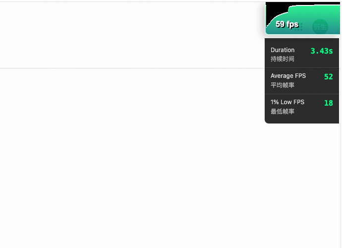

<h1>FPS extension for Chrome</h1>

支持统计一段时间内的平均帧和 1% low 帧。

Displays FPS (Frames Per Second) statistics for web pages, including:

- Average FPS over the measured duration
- 1% Low FPS (1st percentile of lowest frame rates)
- Total duration of measurement

Click the FPS counter in the top-right corner to start/stop measuring.

